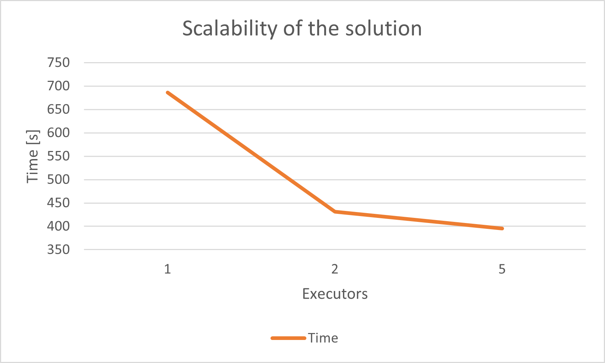

0. The goal of phase 2b is to perform benchmarking/scalability tests of sample three-tier lakehouse solution.

1. In main.tf, change machine_type at:

```
module "dataproc" {
  depends_on   = [module.vpc]
  source       = "github.com/bdg-tbd/tbd-workshop-1.git?ref=v1.0.36/modules/dataproc"
  project_name = var.project_name
  region       = var.region
  subnet       = module.vpc.subnets[local.notebook_subnet_id].id
  machine_type = "e2-standard-2"
}
```

and subsititute "e2-standard-2" with "e2-standard-4".

2. If needed request to increase cpu quotas (e.g. to 30 CPUs): 
https://console.cloud.google.com/apis/api/compute.googleapis.com/quotas?project=tbd-2023z-9918

3. Using tbd-tpc-di notebook perform dbt run with different number of executors, i.e., 1, 2, and 5, by changing:
```
 "spark.executor.instances": "2"
```

in profiles.yml.

4. In the notebook, collect console output from dbt run, then parse it and retrieve total execution time and execution times of processing each model. Save the results from each number of executors. 

The results are available here:

- [1 executor](doc/log_outputs/exec1.txt) - 686.02s
- [2 executors](doc/log_outputs/exec2.txt) - 430.98s
- [5 executors](doc/log_outputs/exec5.txt) - 395.31s

1. Analyze the performance and scalability of execution times of each model. Visualize and discucss the final results.

For total execution time, the number of executors affects it so:



The gap between 5 and 2 executors (a 150% increase) yields an execution time reduction of 8%, and is smaller than the gap between 1 and 2 (a 100% increase), which results in a 37% execution time reduction. While there are gains, these are diminishing returns. Since the increased worker count means increased instance count, which also means increased costs to run, the cost-to-performance ratio drops off drastically.

Per-model execution times look like this:


In case of the first model, 5 runners are less performant than 1 and 2, however that appears to be an anomaly. Especially in case of the models which take more time to execute, 5 runners are faster than 2 or 1, however there are only 7 such models in this project, out of 43 total. For the quick models, which comprise majority of the project, there is no benefit.

Overall, 2 executors is an optimal choice. While the cost increases by a factor of 2, it shaves off a third of the execution time. Going above 2 executors provides minimal benefit.
   